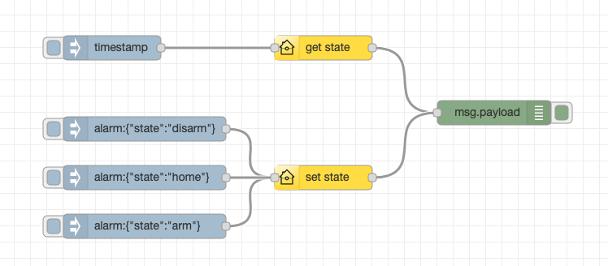

Simple integration between Yale Alarm (API) and Node-RED.

I'm doing this 'cos I have that kit and there is no internal warning system if people enter house/go down while alarm is fully/partially set. So we get false alarms. I can see various other useful use cases (especially with extendend functionality) - did I leave any windows open or am I trying to leave home with windows open? It is possible to check that out now (through the Yale app) but it requires and active role of the user - not automation: trying to set alarm while windows are open should be actively flagged to the user.

So, for now, this code is: to get and set the alarm status of a Yale Alarm from Node-RED

The Yale API is not officially published/supported and in theory might change without notice. That said, while Yale have done a decent job it doesn't appear to evolve particularly quickly. It should be noted that there is no ability to register for notifications (for instance using webhooks). So flows need to be developed in response to external stimuli: so for exmaple, if motion is detected in my hall, check if the alarm is not disarmed (therefore partial/fully armed) and sound an indoor warning to remind occupants to disarm the alarm pronto. Or perhaps using geofencing, disarm for known users.

This initial release is just to do basic get & set functions. I use an Aeotec Indoor Siren 6 in my flow to achieve my inital goal.

There's a richer set of get contact/door etc capabilities to be provided in a future update.

